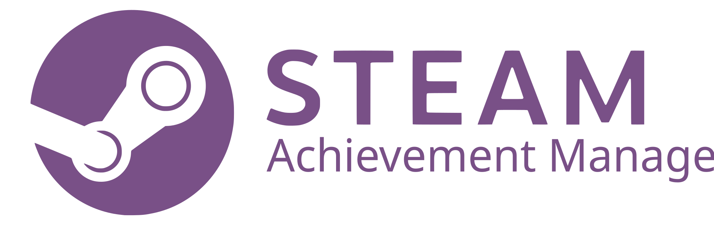
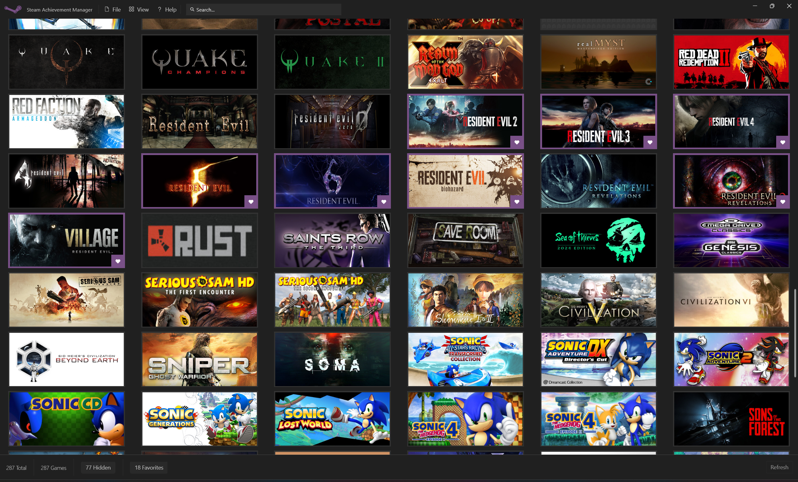
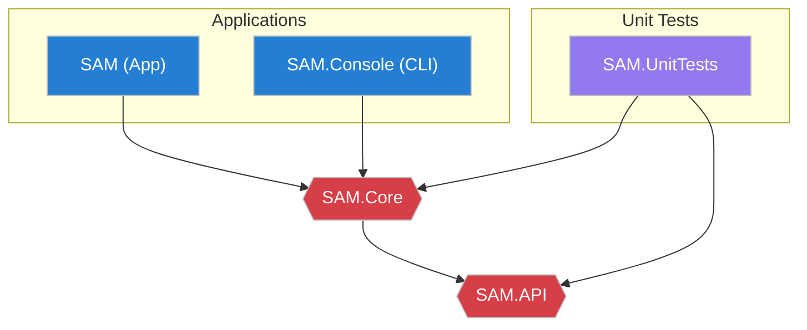

# Steam Achievement Manager

**The ultimate open-source manager for your Steam library.**

 

[📥 **Download Latest Release**](https://github.com/syntax-tm/SteamAchievementManager/releases/latest) &nbsp;&nbsp;•&nbsp;&nbsp; [🐛 Report a Bug](https://github.com/syntax-tm/SteamAchievementManager/issues) &nbsp;&nbsp;•&nbsp;&nbsp; [💬 Join Discussion](https://github.com/syntax-tm/SteamAchievementManager/discussions)

---

## ✨ Overview

**Steam Achievement Manager (SAM)** is a powerful tool that gives you complete control over your Steam library. Whether you want to manage achievements, track statistics, or reorganize your game collection, SAM provides a modern, robust interface to get it done.

> This project is a revitalized, actively maintained fork of the original [Steam Achievement Manager](https://github.com/gibbed/SteamAchievementManager).

   
  
   

## 🚀 Key Features

### 🎨 Modern Experience

- **Smooth Performance:** Features intelligent **Skeleton Loading** for a seamless, lag-free library browsing experience.
- **Visual Excellence:** Enjoy a fully responsive design with **Dark Mode** support, updated icons, and a polished layout.
- **Adaptive Interface:** Optimized for any screen size, treating your library with the visual respect it deserves.

### 🎮 Ultimate Control

- **Library Your Way:** Mark games as **Favorites** ❤️ or **Hide** 🙈 unwanted titles to keep your collection clean.
- **Smart Actions:** Right-click any game for instant access to **SteamDB**, **PCGamingWiki**, and **Store** pages.
- **Deep Depots:** Built-in **Game Updater** allows you to manage game depots and updates directly.

### 🛠️ Power Tools

- **Data Export:** Easily **Export** your library data to JSON for backups or external analysis.
- **Troubleshooting:** One-click access to **Logs** and a **Reset Settings** safety net if things go sideways.
- **Safety First:** Built with modern stability practices to ensure your Steam data is handled safely.

---

## 🏗️ Architecture

**SAM** is modular by design, separating the core logic from the UI for stability and flexibility.

<b>📚 Legacy vs. New Structure (Click to Expand)</b>

 

| Legacy Project | New Project | Description |
| :---: | :---: | :--- |
| **SAM.Picker** | **SAM** | The main executable to browse and select games. |
| - | **SAM.Console** | *WIP* Command-line interface for automation. |
| **SAM.Game** | **SAM** | Integrated game stats & achievement editor. |
| **SAM.API** | **SAM.API** | Managed Steam API wrappers. |
| - | **SAM.Core** | Shared core resources and logic. |

---

## ❤️ Sponsors & Thanks

We are proudly supported by the open-source community.

   
  
  
Special thanks to <b>JetBrains</b> for supporting the project with <a href="https://www.jetbrains.com/community/opensource/#support">Open Source Licenses</a>.

### Acknowledgements

- [DevExpress](https://github.com/DevExpress/DevExpress.Mvvm.Free) for MVVM frameworks.
- [SteamCountries](https://github.com/RudeySH/SteamCountries) for localization data.
- [WPF UI](https://github.com/lepoco/wpfui) for the beautiful UI components.

---

> [!NOTE]
> Active **SAM** contributors are eligible to receive complimentary JetBrains licenses [^1]. Check the [Open Source FAQ](https://sales.jetbrains.com/hc/en-gb/categories/13706169183250-Free-Licenses-for-OSS-development) for details.

[^1]: For non-commercial development
